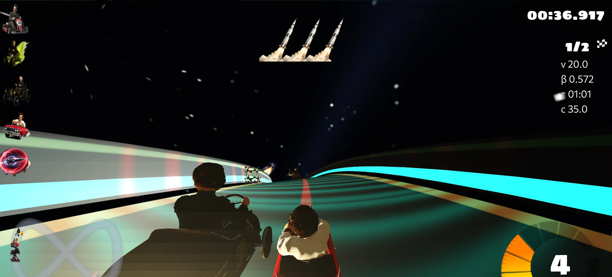

# Minkowski Kart

Minkowski Kart is a free, open-source 3D **relativistic kart-racing game** with time-dilation gameplay, relativistic aberration, Doppler colour effects, and curved-spacetime-inspired power-ups.



<p align="center">
  <a href="https://rchristie95.github.io/MinkowskiKart/download.html"><strong>Download Minkowski Kart</strong></a>
  · <a href="https://rchristie95.github.io/MinkowskiKart/">Website</a>
  · <a href="https://github.com/rchristie95/MinkowskiKart/releases/tag/version_1.9">Latest release</a>
  · <a href="https://github.com/rchristie95/MinkowskiKart">Source code</a>
  · <a href="marketing/video/capture-checklist.md">Gameplay capture plan</a>
</p>

<p align="center">
  
  
  
  <a href="https://github.com/rchristie95/MinkowskiKart/actions/workflows/windows.yml"></a>
</p>

## Race through relativity

Minkowski Kart turns selected ideas from special relativity into readable racing mechanics and visual effects:

- **Adjustable speed of light** with live velocity, beta, Lorentz factor, and proper-time telemetry.
- **Relativistic aberration and retarded apparent positions** applied to moving scene geometry.
- **Directional Doppler colour shifting** during selected item and status effects.
- **Time Dilation** waves that temporarily reduce the effective speed of light for nearby opponents.
- **Black-hole lensing and linked wormholes** as arcade power-ups, alongside photons, warp bubbles, and other physics-themed items.
- **Solo racing, local split-screen, and LAN play**, with keyboard and configurable gamepad or joystick controls.

Minkowski Kart is a physics-inspired arcade game built for fast, playful racing. Bullet-based kart dynamics meet a relativistic speed cap, while black holes, wormholes, and gravitational waves become power-ups and screen-space effects. See [Physics and approximations](#physics-and-approximations).

## Download and play

The current public release is **version_1.9**, with working builds for **Windows, macOS, Linux, and Android**. The exact published Windows archive passes SHA-256, full ZIP integrity, extraction, required gameplay-data and asset checks, and a 44-second headless race-initialisation smoke test. That archive predates the publication-workflow fix and omits a root copy of `COPYING`; the source licence remains available in this repository, and future Windows packages include it. The [download page](https://rchristie95.github.io/MinkowskiKart/download.html) separates confirmed platform support from the exact checks run for each package.

### Windows x64

1. Download [`MinkowskiKart-version_1.9-win.zip`](https://github.com/rchristie95/MinkowskiKart/releases/download/version_1.9/MinkowskiKart-version_1.9-win.zip).
2. Extract the complete archive to a writable folder.
3. Open the extracted folder and run `run_game.bat`.
4. If Windows displays a security warning, verify the file came from the release link above before choosing whether to continue.

No minimum CPU, GPU, memory, or Windows version has yet been established. Enhanced track tessellation requires desktop GLSL 4.00 or newer; the standard rendering mode has lower shader requirements that are not yet formally documented.

| Package | Current evidence |
|---|---|
| Windows | Working x64 build; the exact release archive passes integrity, extraction, gameplay-asset, and headless race-initialisation checks. Its missing root `COPYING` file is fixed for future packages. |
| macOS | Working universal package; headless initialization and unit tests also run in CI. |
| Android | Working ARM64 APK for Android 5.0+; package structure and alignment are also checked in CI. |
| Linux | Working x86-64 package that bundles the complete `stk-assets` pack; packaging asserts the required tracks and karts are present before the archive is compressed. CI builds the client and server across GCC/Clang and Debug/Release configurations. |
| iOS | Ad-hoc IPA for development testing. Player releases focus on Windows, macOS, Linux, and Android. |

All release files are listed on the [version_1.9 release page](https://github.com/rchristie95/MinkowskiKart/releases/tag/version_1.9).

## Controls

Controls are configurable in **Options → Controls**. Keyboard and gamepad/joystick input are supported. For local multiplayer, configure a separate input device or distinct keys for each player, choose **Splitscreen Multiplayer**, and press each device's fire control to join.

## Build from source

Minkowski Kart uses CMake. The automated workflows in [`.github/workflows`](.github/workflows) are the clearest record of the currently exercised toolchains. A fresh Windows checkout needs a compiler/toolchain plus the matching SuperTuxKart dependency bundle; these large build dependencies are not stored in this repository.

### Windows with llvm-mingw and Ninja

Install CMake and Ninja, then place an llvm-mingw toolchain under `.build-tools/llvm-mingw/` and the matching dependency bundle at the repository root. The helper scripts `setup_cmake.ps1` and `setup_dependencies.ps1` can prepare parts of this environment, but downloaded dependencies are not yet content-hash pinned.

```powershell
cmake -S . -B build -G Ninja `
  -DCMAKE_MAKE_PROGRAM="$PWD/.build-tools/ninja/ninja.exe" `
  -DLLVM_ARCH=x86_64 `
  -DLLVM_PREFIX="$PWD/.build-tools/llvm-mingw/<toolchain-directory>" `
  -DCMAKE_TOOLCHAIN_FILE="$PWD/cmake/Toolchain-llvm-mingw.cmake" `
  -DCHECK_ASSETS=OFF `
  -DUSE_WIIUSE=OFF `
  -DSTK_RELEASE_VERSION=version_1.9

cmake --build build --parallel
```

The executable is written to `build/bin/MinkowskiKart.exe`. Run it with the repository data root:

```powershell
./build/bin/MinkowskiKart.exe --root-data="$PWD/data"
```

Linux, Apple, Android, and Switch build recipes remain in their existing workflow and platform directories. See [CONTRIBUTING.md](CONTRIBUTING.md) before submitting changes.

## Physics and approximations

The game computes beta and the Lorentz factor from each kart's speed and the configured in-game speed of light. It accumulates per-kart proper time, derives a relativistic aberration transform, estimates retarded emission positions, and applies a directional Doppler/searchlight colour transform in the renderer.

The visual pipeline applies aberration and apparent-position transforms while keeping scene positions, normals, and tangents stable for responsive racing. Selected items and status effects activate the directional Doppler colour shift. Bullet physics and a relativistic velocity limit shape the arcade handling.

Black holes combine a homing projectile with analytic screen-space lensing. Wormholes are linked, bidirectional teleporters whose lensing effects announce a shortcut through the track. Together they turn curved-spacetime inspiration into immediate arcade mechanics.

For implementation detail and equations, see:

- [`src/relativity/relativity_math.cpp`](src/relativity/relativity_math.cpp)
- [`data/shaders/utils/relativity_visual.vert`](data/shaders/utils/relativity_visual.vert)
- [`data/shaders/utils/relativity_color.frag`](data/shaders/utils/relativity_color.frag)
- [`paper/ajp-minkowski-kart/`](paper/ajp-minkowski-kart)
- [Website physics guide](https://rchristie95.github.io/MinkowskiKart/physics.html)

## Multiplayer status

Local split-screen and LAN play are implemented. The source also contains online services and server-authoritative relativity settings, but the public account, API, and relay infrastructure is not deployed as a turnkey service. See [`doc/ONLINE_INFRASTRUCTURE.md`](doc/ONLINE_INFRASTRUCTURE.md) for the operator setup and current limitations.

## Credits, licence, and acknowledgements

Minkowski Kart was created by **Robson Christie** and is based on [SuperTuxKart](https://github.com/supertuxkart/stk-code). It incorporates and adapts ideas and colour-shift code from the MIT Game Lab's [OpenRelativity](https://github.com/MITGameLab/OpenRelativity), under the MIT License.

The program is distributed under the **GNU General Public License version 3 or later**; see [COPYING](COPYING). Bundled artwork, audio, tracks, and other assets retain their own attribution and licence records throughout `data/` and `stk-assets/`. See [ATTRIBUTION.md](ATTRIBUTION.md) for the project-level overview.

Bug reports and build problems belong in [GitHub Issues](https://github.com/rchristie95/MinkowskiKart/issues). Please do not report security vulnerabilities publicly; use the process in [SECURITY.md](SECURITY.md).
