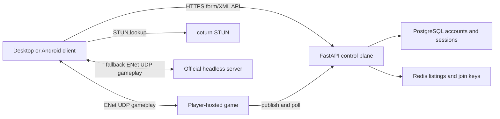

# MinkowskiKart Online Infrastructure

## Implemented Architecture

Online play continues to use the game's ENet peer/server gameplay protocol.
The new service is the control plane: it signs invited players in, lists
player-hosted rooms, and securely passes short-lived AES connection details
from a joining player to a host.



Every invited account may host one active public listing. The official server
exists as a reliable public fallback for players whose home networks cannot
accept the existing UDP hole-punch path. TURN relay is not included in this
first version.

## Test With Two Android Devices

Do not use an APK produced before the protocol-v7 changes. Build a fresh APK,
then install the same build on both devices.

For the first smoke test, put both devices on the same Wi-Fi network. On the
first device choose `Online` -> `Local Network` -> `Create Server`; on the
second choose `Online` -> `Local Network` -> `Find Server` and join the room.
This verifies Android packaging, lobby protocol v7, gameplay traffic, and
server-authoritative relativity rules without requiring the API or STUN.

For the complete owned-infrastructure test, first deploy the HTTPS API and
STUN services below, replace the `minkowskikart.example` placeholders, and
rebuild the APK. Create two invited accounts. Sign device A in with the first
account and select `Global Networking` -> `Create Server`; sign device B in
with the second account, select `Global Networking` -> `Find Server`, and
join A's listing. Run this once on the same Wi-Fi and once with device B on
mobile data to exercise the WAN rendezvous and NAT path.

For API-only local development, a USB-connected phone can access a PC-hosted
API configured as `http://127.0.0.1:8000/api/` by running:

```powershell
$adb = "$env:LOCALAPPDATA\Android\Sdk\platform-tools\adb.exe"
& $adb reverse tcp:8000 tcp:8000
```

Repeat the reversal once for each connected device. This does not replace
STUN and therefore is not by itself a complete Global Networking test.

## Game Changes

- The wire protocol is version `7` and requires `minkowski_rules_v1`, keeping
  modified clients and servers separate from SuperTuxKart public servers.
- Hosts publish authoritative `relativity-normal-c-light` and
  `relativity-max-beta` values; clients apply those values during online play.
- Physics speed limits now use each kart's active time-dilation or warp-bubble
  target. The smooth local `c` transition remains a rendering effect only.
- HTTPS is accepted for online requests; unencrypted HTTP is permitted only
  for `localhost` and `127.0.0.1` development.
- Friends, public achievements tabs, and email changing are hidden for v1.
  Login, saved sessions, password changes, hosting, listing, and joining are
  backed by the new API.

## Deploy On One VPS

Requirements: a Linux VPS with Docker Compose, a domain you control, TCP
ports `80` and `443`, UDP port `443`, TCP/UDP port `3478`, and UDP port
`2759` open in its firewall.

1. Choose hostnames, for example `online.yourdomain.com`,
   `stun.yourdomain.com`, and `stun4.yourdomain.com`.
2. Create DNS `A`/`AAAA` records for those hostnames pointing at the VPS.
   Create SRV records `_stunv4._udp.yourdomain.com` and
   `_stunv6._udp.yourdomain.com` pointing at `stun.yourdomain.com:3478`.
3. Replace every `minkowskikart.example` placeholder in
   `data/stk_config.xml` and `src/config/user_config.hpp` with your domain
   before producing desktop or Android builds.
4. On the VPS, copy `deploy/online/.env.example` to `deploy/online/.env`,
   set `MK_ONLINE_DOMAIN`, generate a strong PostgreSQL password, and fill in
   the official host credentials after creating that account.
5. Start the database and API first:

```bash
cd deploy/online
docker compose up -d postgres redis api caddy stun
docker compose exec api python -m app.admin create-user --username official-host --official-host
docker compose exec api python -m app.admin create-user --username your-player-name
```

6. Set the official account password in `.env`, then start the public fallback:

```bash
docker compose up -d --build official-server
docker compose ps
curl "https://online.yourdomain.com/healthz"
```

7. Build and distribute protocol-v7 desktop and Android clients only after the
   DNS and HTTPS endpoint are live.

## Invite And Hosting Operations

Create one account per invited player:

```bash
docker compose exec api python -m app.admin create-user --username alice
```

The command securely prompts for a password. Provide that username and
password to the invited player through your chosen private channel. A signed
in invited player can choose Global Networking and host from the game UI; the
listing automatically expires within 20 seconds when their host stops polling.

To tune the official fallback server, edit
`deploy/online/official_server_config.xml`. These two settings are sent to all
connected clients and are authoritative for online physics:

```xml
<relativity-normal-c-light value="35" />
<relativity-max-beta value="0.98" />
```

## Security And Limits

- Keep `.env` off source control and back up the PostgreSQL volume.
- Caddy obtains and renews TLS certificates automatically once DNS resolves.
- The API never logs passwords, session tokens, or AES rendezvous material.
- STUN helps most home-hosted games traverse NAT; users behind restrictive or
  symmetric NAT should use the official fallback server or configure UDP port
  forwarding. A later phase can add TURN relay or dedicated match instances.
- Add-ons, news, ranking, email recovery, and public self-registration are not
  part of this initial owned infrastructure.
